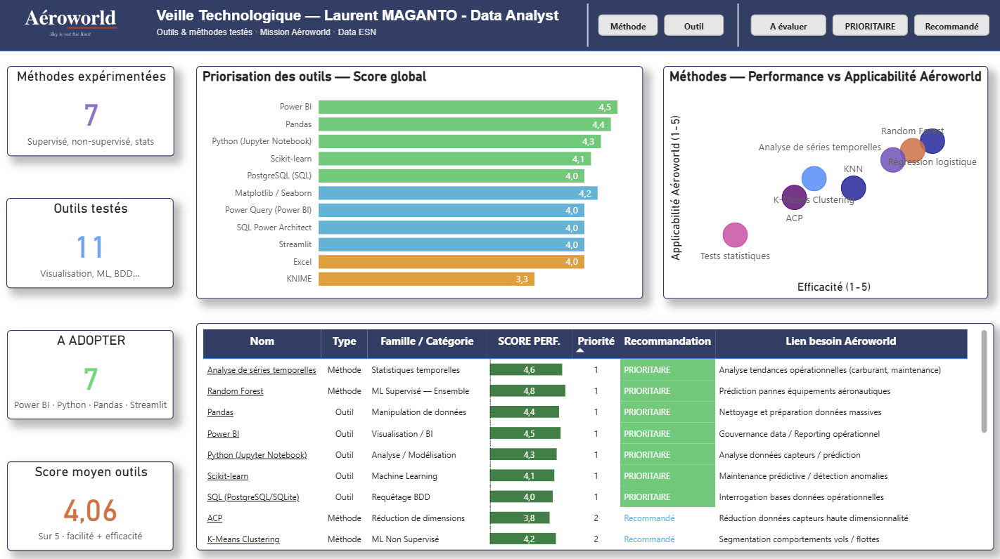

# Dashboard – Veille Technologique

## 📌 Présentation

Ce dashboard Power BI a été conçu dans le cadre du projet de portfolio (P13) pour assurer la **veille technologique** du domaine de la Data. Il permet de centraliser, visualiser et analyser les tendances, outils et évolutions du secteur, afin de rester à jour sur les technologies émergentes et les pratiques actuelles de la Data Analyse.

## 📂 Contenu du dossier

| Fichier | Description |
|---|---|
| `dashboard_veille_techno.pbix` | Fichier Power BI du dashboard |
| `Veille_Technologique_AEroworld.xlsx` | Source de données Excel |
| `P13 - Mock-up Dashboard Veille Technologique.pdf` | Maquette initiale du dashboard |
| `dashboard_veille_techno.png` | Capture d'écran du dashboard |

## 📊 Aperçu du dashboard

