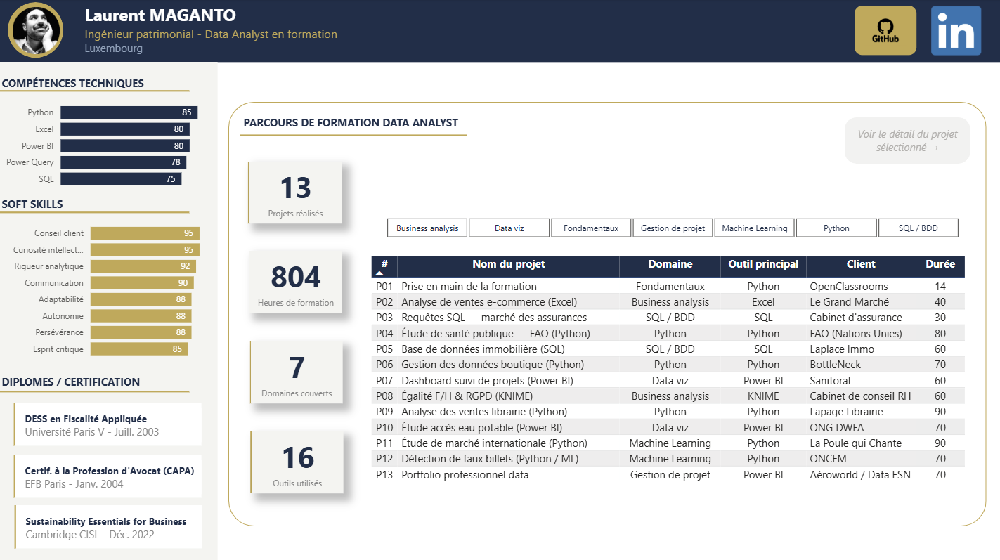
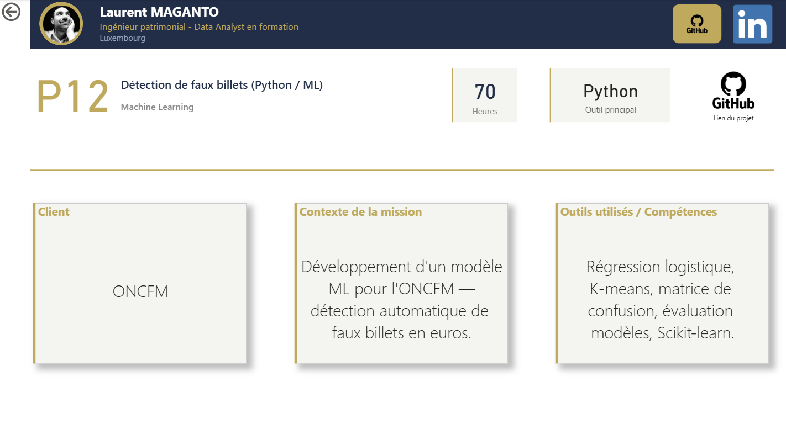

# Dashboard – Profil Data Analyst

 

## 📌 Présentation

Ce dashboard Power BI synthétise le **profil Data Analyst** constitué tout au long de la formation. Il met en valeur les compétences acquises, les outils maîtrisés et les projets réalisés, offrant une vue d'ensemble claire et structurée du parcours professionnel.

## 🗂️ Maquette (Mock-up)

La maquette du dashboard a été réalisée sur Miro : [Voir le mock-up sur Miro](https://miro.com/app/live-embed/uXjVGx9paSc=/?focusWidget=3458764663735972515&embedMode=view_only_without_ui&embedId=238244434982)

## 📂 Contenu du dossier

| Fichier | Description |
|---|---|
| `dashboard_profil_LM.pbix` | Fichier Power BI du dashboard |
| `Dashboard_Profil_LM.xlsx` | Source de données Excel |
| `P13 - Mockup Dashboard PROFIL.pdf` | Maquette initiale du dashboard |
| `dashboard_profil_LM_1.png` | Capture d'écran – vue 1 |
| `dashboard_profil_LM_2.png` | Capture d'écran – vue 2 |

## 📊 Aperçu du dashboard

