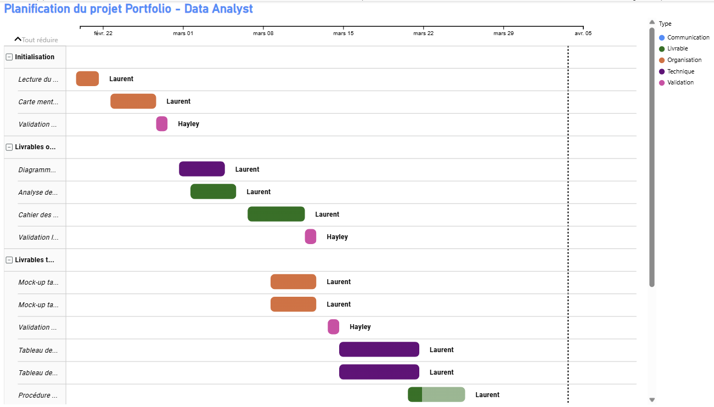

# Gantt – Suivi du projet portfolio

## 📌 Présentation

Ce diagramme de Gantt a été réalisé dans Power BI pour planifier et suivre l'avancement du projet de portfolio (P13). Il visualise les différentes phases du projet, leurs durées et leur enchaînement, permettant un pilotage clair du planning.

## 📂 Contenu du dossier

| Fichier | Description |
|---|---|
| `3_Gantt_Chart_Aeroworld.pbix` | Fichier Power BI du Gantt |
| `Gantt Projet13 PowerBI.xlsx` | Source de données Excel |
| `Gantt.png` | Capture d'écran du diagramme |

## 📊 Aperçu

